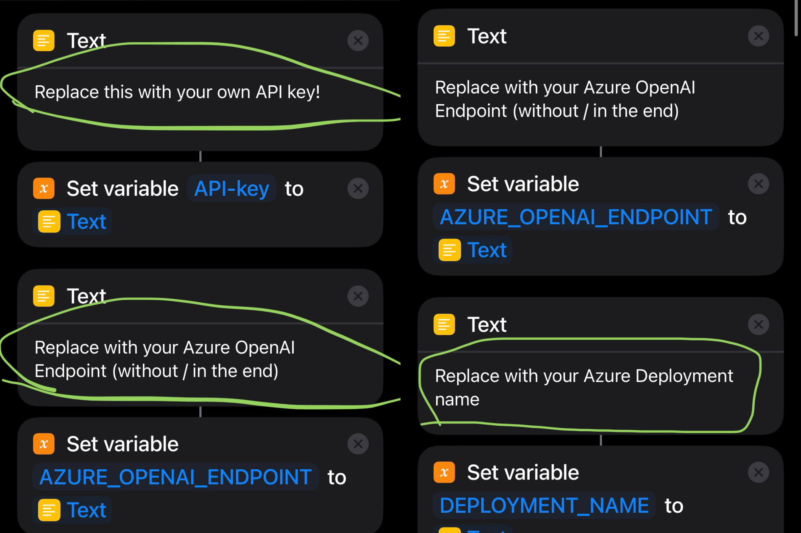

# 🤖️ AzureGPT Siri

Start the "Shortcut" through Siri to connect to the Azure OpenAI API, turning Siri into an AI chat assistant. You can speak your question directly to Siri, and Siri will answer you. Now our Siri has finally become intelligent and can talk to us fluently! And all this can be done with just a Shortcut and an API key.

**Since OpenAI restricts using its services in many countries, Azure OpenAI API is a better choice, don't need to use VPN, while can access the same GPT models as in OpenAI API.**

# Preparation

- Ensure that there is enough balance in the API account: https://portal.azure.com/#home.
- Use Siri to start the shortcut: open Settings-> Siri Answer-> Automatic. Check "Always show what you say to Siri" to see if recognition is accurate. Ensure that Siri's language setting matches the language you are using.
- For versions 1.2 and above, you need to turn on the "Settings" - Apple ID - iCloud - iCloud Drive function to use the save to TXT file function.

# Shortcut Download

Click the link below to download shortcuts, support iPhone、iPad、Mac、HomePod、CarPlay.

### Azure ChatGPT Siri 1.0

- [English Version](https://www.icloud.com/shortcuts/002ea0e8511f4a1abf8e35fd11f96bd7)

# Edit shortcut to replace API key, Azure OpenAI Endpoint and Deployment Name

Open the "Shortcuts" app, find the downloaded "ChatGPT" shortcut, press and hold to select "Edit", and paste the above API key, Azure OpenAI Endpoint and Deployment Name into the text boxes below.

**API-KEY**	This value can be found in the Keys & Endpoint section when examining your resource from the Azure portal. You can use either KEY1 or KEY2.

**ENDPOINT:** This value can be found in the Keys & Endpoint section when examining your resource from the Azure portal. Alternatively, you can find the value in the Azure OpenAI Studio > Playground > Code View. An example endpoint is: https://docs-test-001.openai.azure.com (no / in the end).

**Deployment Name**  See https://learn.microsoft.com/en-us/azure/cognitive-services/openai/how-to/create-resource?pivots=web-portal

# How to use it

Start the "shortcut" with Siri, just say "Hey, Siri, Azure", and then you can start chatting with Siri, our Siri has become very smart, enjoy! 🎉

**If you don't like the name, you can rename the shortcut, change it to any name you like, and then you can chat with Siri just say "Hey, Siri, xxx", xxx is the new name you  chose, it's better not to add special symbols to the name. It’s hard to read the symbols 😂, If Siri cannot match the name of the shortcut, it won’t work!**

Of course, you can also directly click the shortcut to use. At this time, it is used in the form of a dialog box, and it will not be read out. You can add it to your Home Screen for quick access. end 🎉

# Advanced usage

This shortcut supports iPhone, iPad and Mac, supports continuous conversations, supports quit chat, new chat. The usage is as follows:

- The default is to support continuous dialogue, which can record context and discuss issues continuously.
- If you want to start a new chat, say "New chat" when it's our turn, Siri will start a new round of chat, which means that the previous context will be lost, and you can't continue chatting with the previous information.
- If you want to quit Azure ChatGPT to use the system's Siri, you can say "Quit chat" on your turn. Of course, you can also close Siri directly and open it again. But here it is more natural to provide the command to exit.

## Customize name, icon and hint messages.

- img1: Rename and choose icon
- img2: Welcome and continue hints

| img1 | img2 |
| :-------------: |:-------------:|
|  |  |

Customize hint messages.

- img1: Quit chat command, quit chat hint
- img2: New chat command, new chat welcome hint

| img1 | img2 |
| :-------------: |:-------------:|
|  |  |

## Customize system message

You can also customize system message, which help set the behavior of the assistant. In this "shortcut" system message is one of the default system messages of ChatGPT used:

> You are ChatGPT, a large language model trained by OpenAI. Answer as concisely as possible. Knowledge cutoff: Sep 2021.

Modify method, edit the "shortcut", slide down, and find the position.

For example, you can replace system message with the following:

> I will let you act as a translator. Your goal is to translate any language into English. Please do not use an interpreter accent when translating, but to translate naturally, smoothly and authentically, using beautiful and elegant expressions.

Of course, you can also write it yourself, such as asking him to be a joker, a writer, a chef, etc. There are endless ways to play. You can also find a prompt written by someone else on the Internet, and fill it in here with a little modification. Here it is recommended to  duplicate the "shortcut" and give the cope one a different name. For example, the shortcut for translation is called "My Translator", so you can just say "Hey, Siri, My Translator", and start a ChatGPT dedicated to translation.

Also you can directly say what you want the ChatGPT to be when it's your turn to say. For example ask him to help you as a translator. But it’s not as convenient as the “shortcut” above that specifically modifies the system message for translation. That “translator” can work directly, which is very nice! This is also the meaning of Prompt, you can customize the using scene first, and then use ChatGPT more efficiently. This is why there are so many awesome prompt tutorials on the Internet. We can build our own prompt suitable for us and let ChatGPT to be more powerful!
